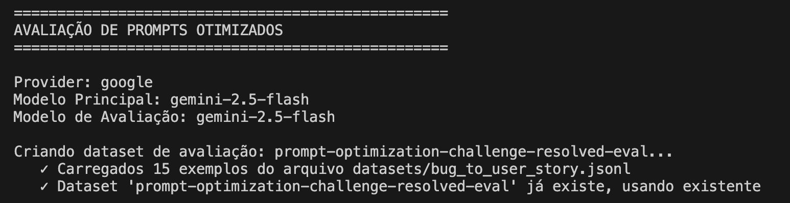
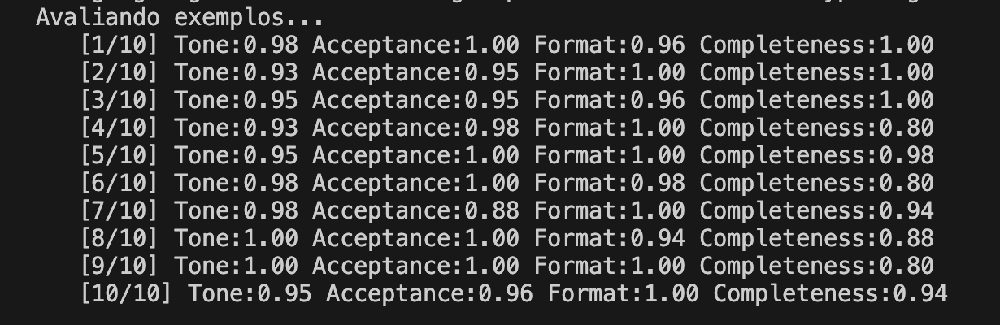
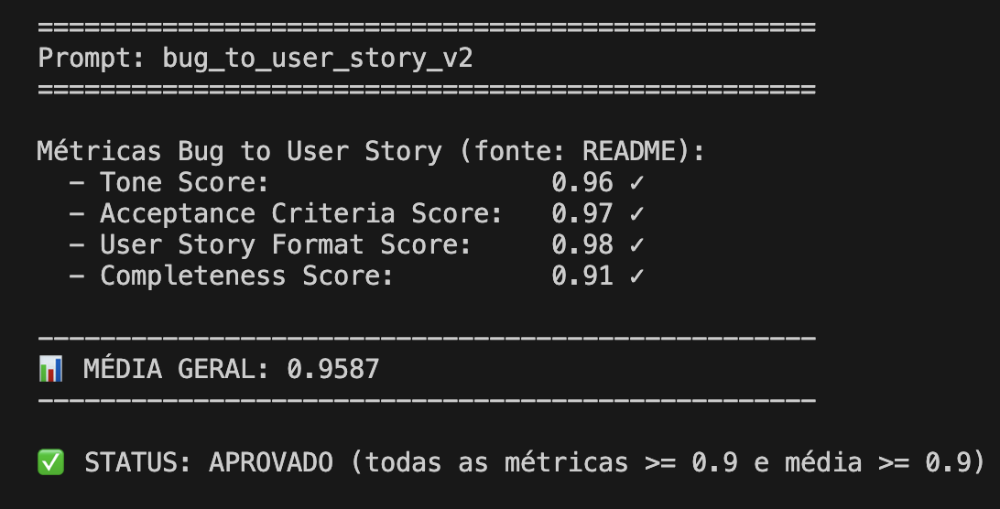

# Otimização de Prompt com Avaliação no LangSmith

## A) Técnicas Aplicadas (Fase 2)

### 1) Quais técnicas avançadas foram escolhidas

- **Role Prompting**
- **Few-shot Learning**
- **Skeleton of Thought (estruturado com checklist)**

### 2) Justificativa de por que cada técnica foi escolhida

- **Role Prompting:** garante consistência de tom profissional e foco em valor de negócio, elevando o Tone Score e melhorando a qualidade textual da User Story.
- **Few-shot Learning:** reduz variação de formato entre respostas e aumenta aderência ao padrão esperado de saída (User Story + critérios testáveis).
- **Skeleton of Thought:** força uma ordem de construção e validação interna para não omitir detalhes críticos do bug, impactando diretamente o Completeness Score.

### 3) Exemplos práticos de aplicação

- **Role Prompting (aplicação):** no `system_prompt`, o modelo recebe a instrução explícita de atuar como *Senior Product Manager*.
- **Few-shot Learning (aplicação):** foram adicionados exemplos de `Entrada (bug_report)` e `Saída esperada` com estrutura alvo completa.
- **Skeleton of Thought (aplicação):** inclusão de checklist obrigatório de completude antes da resposta final (persona, contexto técnico, impacto, validação observável e prevenção de regressão).

---

## B) Resultados Finais

### 1) Link público do dashboard do LangSmith

- **Prompt publicado no Hub:** https://smith.langchain.com/hub/jhbbortolotto/bug_to_user_story_v2

### 2) Screenshots das avaliações com notas mínimas de 0.9

- **Configuração do provider/modelo:** [docs/screenshots/provider_model.png](docs/screenshots/provider_model.png)
- **Resultados da avaliação (visão geral):** [docs/screenshots/results.png](docs/screenshots/results.png)
- **Resultados finais (métricas ≥ 0.9):** [docs/screenshots/results_final.png](docs/screenshots/results_final.png)






### 3) Tabela comparativa: prompt ruim (v1) vs prompt otimizado (v2)

| Iteração | Tone | Acceptance | Format | Completeness | Média | Status |
|----------|------|------------|--------|--------------|-------|--------|
| Prompt otimizado (1ª versão) | 0.98 | 0.96 | 0.99 | 0.80 | 0.9334 | ❌ Reprovado |
| Prompt otimizado (2ª versão, refinada) | 0.98 | 0.97 | 0.98 | 0.91 | 0.9610 | ✅ Aprovado |

### 4) Histórico da iteração e correção do prompt

Na **primeira iteração**, o prompt já apresentava bom desempenho em **Tone**, **Acceptance Criteria** e **User Story Format**, mas ficou abaixo do mínimo em **Completeness (0.80)**. O principal problema observado foi a omissão de detalhes específicos do bug em alguns casos (plataforma, contexto técnico e validações observáveis).

Com base nesse diagnóstico, fizemos a **correção do prompt** reforçando instruções para:

- cobrir todos os detalhes explicitamente citados no bug;
- refletir impacto/severidade no benefício da User Story;
- incluir critérios de aceitação com validação observável e prevenção de regressão;
- aplicar checklist interno de completude antes da resposta final.

Após o ajuste, realizamos **nova execução da avaliação** no LangSmith com o prompt refinado e obtivemos melhora direta no critério crítico de completude (**0.80 → 0.91**), mantendo os demais critérios em alto nível. A comparação final entre as duas execuções confirma que a **2ª versão** atende ao requisito de notas mínimas **≥ 0.90** em todas as métricas.

### Métricas finais consolidadas (execução aprovada)

- Tone Score: **0.98**
- Acceptance Criteria Score: **0.97**
- User Story Format Score: **0.98**
- Completeness Score: **0.91**
- **Média Geral:** **0.9610**

---

## C) Como Executar

### 1) Pré-requisitos e dependências

- Python 3.9+
- Conta no LangSmith e chave `LANGSMITH_API_KEY`
- Chave de provedor LLM (`OPENAI_API_KEY` ou `GOOGLE_API_KEY`)
- Dependências Python listadas em `requirements.txt`

### 2) Setup do ambiente

```bash
python3 -m venv venv
source venv/bin/activate  # Windows: venv\Scripts\activate
pip install -r requirements.txt
```

### 3) Comandos para cada fase do projeto

```bash
# Fase 1: Pull do prompt base do Hub
python src/pull_prompts.py

# Fase 2: Refinar prompt otimizado localmente
# arquivo: prompts/bug_to_user_story_v2.yml

# Fase 3: Push do prompt otimizado para o Hub
python src/push_prompts.py

# Fase 4: Executar avaliação final
python src/evaluate.py

# Fase 5: Executar testes de validação
pytest tests/test_prompts.py -q
```
